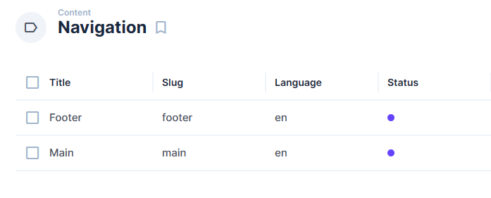

<a href="https://github.com/luochuanyuewu/nextus" target="_blank">
  <h1 align="center">Nextus</h1>
</a>

Welcome to Nextus! Nextus is a comprehensive, versatile and modern website template based on Next.js and Directus technologies. It helps you build various types of web projects more quickly.

  <a href="#introduction"><strong>Introduction</strong></a> ·
  <a href="#tech-stack"><strong>🧰 Tech Stack</strong></a> ·
  <a href="#installation-and-development"><strong>🚧 Installation and Development</strong></a> ·
  <!-- <a href="#deployment"><strong>🚢 部署/Deployment</strong></a> · -->
  <!-- <a href="#features"><strong>⭐ 特性/Features</strong></a> · -->
  <a href="#roadmap"><strong>💼 Roadmap</strong></a> ·
  <a href="#other-resources"><strong>💼 Other Resources</strong></a> ·
  <a href="#contributors"><strong>👥 Contributors</strong></a>
  <a href="#contributing"><strong>👥 contributing</strong></a>

 

# Introduction

Spin up a beautiful site in minutes. Or use Nextus as the foundation for your next awesome project.

[**-> View The Demo Site**](https://nextus.vercel.app/)

**Features**

- Complete Next.js 13 website example
- Multi languages support, currenly en/zh. You can add more.
- Built-in Directus - Headless CMS support
- Tailwind CSS and Daisyui
- Dynamic Page Builder (M2A Interface) within Directus
- Blog posts and categories
- Projects pages
- Dynamic form generation with validation
- Dynamic social image generation
- SEO support
- Global search component and API route
- Ready to use common components like modals, dropdowns, and file upload input
- Common utilities so you don't need to include yet another package
- Easy SVG Icons using Iconify Icon
- Google Fonts support
- ESLint and Prettier already configured
- Many theme provided by Daisyui
- Written in Typescript and new Directus TS SDK

 

# Tech Stack

## Next.js

Build your next web application with confidence using Next.js. An open source framework under MIT license that makes web development simple and powerful. The leading React framework that handles routing, server side rendering, and more.

[Learn more about Next.js](https://nextjs.org)

---

## Directus

Directus is a headless CMS that instantly turns your SQL database into REST and GraphQL APIs and gives you a beautiful, intuitive no-code app to manage all your content and data.
But it's also more than just a headless CMS. It’s an open data platform that has all the tools you need for creating, managing, serving, visualizing, and even automating your data for your next web, mobile, or digital project.

For a smooth experience, the [Directus SDK](https://docs.directus.io/guides/sdk/getting-started.html) is already integrated for you and availably globally.

[Learn more about Directus](https://directus.io)

---

## UI

- [Tailwind CSS](https://tailwindcss.com/) – Utility-first CSS framework that allows you to rapidly build sites and maintain consistency across team members. There are several Tailwind Plugins installed and ready to use as well – [Typography](https://tailwindcss.com/docs/typography-plugin) and [Forms](https://tailwindcss.com/docs/plugins#forms).
- [Daisyui](https://daisyui.com/) – The most popular component library for Tailwind CSS.
- [React Hook Form](https://react-hook-form.com/) – Form library for React that saves you hours of time by simplifying form creation.
- [Iconify for React](https://github.com/iconify) - Modern unified SVG framework. One syntax for many icon sets: FontAwesome, Material Design Icons, Dashicons and many others. Over 150,000 icons, very easy to use.

## Utilities

- [React-Use](https://github.com/streamich/react-use) – React Hooks — 👍
- [Framer-Motion](https://www.framer.com/motion/) – Framer Motion is a simple yet powerful motion library for React.

 

# Installation and Development

## Directus - Headless CMS

### 1 Setup Directus

Use [Directus Cloud](https://directus.cloud/register)/[Self-Hosting](https://docs.directus.io/self-hosted/quickstart.html) to quickly set up your own instance of Directus.

Then, apply the [Schema Snapshot](https://github.com/luochuanyuewu/nextus-docker/blob/main/snapshots/schema.yml) provided by Nextus using the [Schema Migration](https://docs.directus.io/guides/migration/hoppscotch.html) feature.

Or, using [Nextus-Docker](https://github.com/luochuanyuewu/nextus-docker) to quickly setup Nextus backend with automaic schema applying.

This way, your Nextus backend will be fully prepared.

### 2 Setup required Content/Environment

After setting up the Directus instance, you need to prepare the following necessary content for the frontend to function properly.

Content-related:

- Add the languages you need to the Languages model (though you can add as many as you want, but currently only 'en' and 'zh' supported)
- Add a page with the slug "home"
- Add a top navigation with the slug "main" and a footer navigation with the slug "footer"
- Add other required data in "global" seciton

Environment variables:

- Refer to .env.example

---

## Nextus - Frontend (前端)

Nextus is built using Next.js 13 on the front-end. All you need to do is fork a copy to your own GitHub account, connect it with Vercel, set up a few environment variables (for connecting with Directus), and your Nextus will be live.

Of course, you can also clone the repository locally and customize it according to your own needs.

## Enjoy!

Now, you have a Nextus backend (built with Directus) and a Nextus frontend (built with Next.js).

Start adding your own content in Nextus and experience the charm of headless CMS and modern frontend websites!

 

# Roadmap

- [ ] Analysis support (Google,Baidu,Umami)
- [x] Fully multiple language supports for form, artilce, page and projects
- [x] Dedicated documentation site
- [x] Auth module
- [x] Redirects module (重定向模块)
- [x] Fetching frontend translations via backend (Directus translation)
- [x] Page width controlled by backend
- [x] Content management for documentation
- [x] Payment module (pay to watch article, page)
- [x] Token based access control for file download
- [x] AI powered content writing and image producing, all resisted within Directus

 

# Other Resources

- **[Directus Discord](https://discord.com/invite/directus)** – Join 10k+ developers and community members to ask questions and live discussion around Directus.
- **[Next.js Discord](https://discord.com/invite/bUG2bvbtHy)**

 

# Contributors

- 罗传月武 ([@luochuanyuewu](https://twitter.com/luochuanyuewu))

# Credits

- Bryant Gillespie ([@bryantgillespie](https://twitter.com/bryantgillespie))

Nextus originally based on [AgencyOS Template](https://github.com/directus-community/agency-os) created by Bryant Gillespie. Now Nextus has it's own direction (see [Roadmap](#roadmap)).

# Contributing

Contributions welcome! Read the [contribution guidelines](contributing.md) first.

# Statement

Originally, I encountered Strapi before I discovered Directus, so I built my personal website with it (this repository). After encountering Directus and trying it for a week, I immediately switched from Strapi to Directus, and my personal website also started to transition towards the AgencyOS template. This is why you can still see some Strapi-related components in the repository (marked as _Deprecated), but please don't worry, these files will also be adopted into Directus, so that Nextus will have more Blocks to use.
