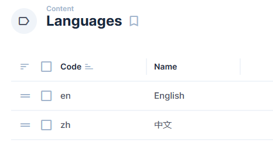

<a href="https://github.com/luochuanyuewu/nextus" target="_blank">
  <h1 align="center">Nextus</h1>
</a>

# Notice

欢迎来到Nextus, Nextus是一个完整全面、且多功能的现代化网站模板，基于Nextjs和Directus技术。帮助你更快速地构建各种类型的网站。

  <a href="#introduction"><strong>介绍</strong></a> ·
  <a href="#tech-stack"><strong>🧰 技术栈</strong></a> ·
  <a href="#installation-and-development"><strong>🚧 安装和开发</strong></a> ·
  <!-- <a href="#deployment"><strong>🚢 部署/Deployment</strong></a> · -->
  <!-- <a href="#features"><strong>⭐ 特性/Features</strong></a> · -->
  <a href="#roadmap"><strong>💼 开发计划</strong></a> ·
  <a href="#other-resources"><strong>💼 其他资源</strong></a> ·
  <a href="#contributors"><strong>👥 贡献者</strong></a>
  <a href="#contributing"><strong>👥 参与贡献</strong></a>

 

# Introduction

在几分钟内建立一个漂亮的网站。或者使用Nextus作为您下一个出色项目的基础。

[**-> Demo网站**](https://nextus.vercel.app/)

**已支持特性**

- 完整的NextJs 13 网站案例
- 多语言支持，目前支持中文和英文，你可以自行添加更多。
- 内置Directus - 无头CMS支持
- 使用Tailwind CSS 和 Daisyui完成主题开发
- 在Directus中使用ManyToAny界面动态构建网页
- 博客文章和分类
- 项目页面
- 动态生成带验证规则的表单
- 动态社交图片生成
- 支持SEO
- 全局搜索组件和NextJs Api路由
- 预制通用UI组件
- 常用函数所以你不用包含其他额外第三方包
- 通过Iconfy Icon库方便使用各种SVG图标
- Google字体支持
- 已经配置好了ESLint和Prettier
- 通过Daisyui提供了很多主题
- 完全使用Typescript编写，并使用了最新的Directus Typescript SDK

 

# 技术栈

## NextJs13

Build your next Next.js application with confidence using Next. An open source framework under MIT license that makes web development simple and powerful. The leading React framework that handles routing, server side rendering, and more.

[Learn more about Next](https://nextjs.org)

---

## Directus

Directus is a headless CMS that instantly turns your SQL database into REST and GraphQL APIs and gives you a beautiful, intuitive no-code app to manage all your content and data.
But it's also more than just a headless CMS. It’s an open data platform that has all the tools you need for creating, managing, serving, visualizing, and even automating your data for your next web, mobile, or digital project.

For a smooth experience, the [Directus SDK](https://docs.directus.io/guides/sdk/getting-started.html) is already integrated for you and availably globally.

[Learn more about Directus](https://directus.io)

---

## UI

- [Tailwind CSS](https://tailwindcss.com/) – Utility-first CSS framework that allows you to rapidly build sites and maintain consistency across team members. There are several Tailwind Plugins installed and ready to use as well – [Typography](https://tailwindcss.com/docs/typography-plugin) and [Forms](https://tailwindcss.com/docs/plugins#forms).
- [Daisyui](https://daisyui.com/) – The most popular component library for Tailwind CSS.
- [React Hook Form](https://react-hook-form.com/) – Form library for React that saves you hours of time by simplifying form creation.
- [Iconify for React](https://github.com/iconify) - Modern unified SVG framework. One syntax for many icon sets: FontAwesome, Material Design Icons, Dashicons and many others. Over 150,000 icons, very easy to use

## Utilities

- [React-Use](https://github.com/streamich/react-use) – React Hooks — 👍
- [Framer-Motion](https://www.framer.com/motion/) – Framer Motion is a simple yet powerful motion library for React.

 

# 安装和开发

## Directus - Headless CMS

### 1 设置Directus实例

使用[Directus Cloud](https://directus.cloud/register)或者根据Directus提供的[自行托管](https://docs.directus.io/self-hosted/quickstart.html)教程，快速搭建属于自己的Directus实例。

然后使用[Schema迁移](https://docs.directus.io/guides/migration/hoppscotch.html)功能，将Nextus所提供的[Schema](https://github.com/luochuanyuewu/nextus-docker/blob/main/snapshots/schema.yml)应用到你的directus实例。

或者，使用[Nextus-Docker](https://github.com/luochuanyuewu/nextus-docker) 快速设置 Nextus 后端，并在启动时自动应用模式。

这样，你的Nextus后端就完全准备好了。

### 2 设置所需的内容和环境变量

在搭建好Directus实例后，你需要准备如下必要的内容，这样前端才能正常运转。

内容相关：

- 添加你需要的语言到Languages模型，
- 添加slug为"home"的页面，
- 添加slug为"main"的顶部导航和slug为"footer"的底部导航
- 配置"global"中的必要数据

环境变量：

- 参考.env.example

image references:

---

## Nextus - Frontend(前端)

Nextus前端使用Nextjs 13 构建，你需要做的就是fork一份到你自己的Github账户，然后与Vercel连接，设置几个环境变量（用于连接Directus），然后你的Nextus就上线了。

当然，你也可以克隆仓库到本地，然后根据你自己的需求进行二次开发。

## Enjoy!

现在，你有了一个Nextus后端（使用Directus构建），也有了一个Nextus前端（使用Nextjs构建）。

开始开始在Nextus中添加属于你自己的内容并感受无头CMS和现代化前端网站带来的魅力吧！

 

# Roadmap
- [ ]Analysis support(Google,Baidu,Umami)
- [x]Fully multiple language supports for form, artilce, page and projects.
- [x]Dedicated documentation site.
- [x]Auth module.
- [x]Redirects module(重定向模块)
- [x]Fetching frontend translations via backend(directus translation)
- [x]age width controlled by backend.
- [x]Content management for documentation.
- [x]Payment module(pay to watch article,page)
- [x]Token based access control for file download.
- [x]AI powered content writing and image producing(All resisted within directus)

 

# Other Resources

- **[Directus Discord](https://discord.com/invite/directus)** – Join 10k+ developers and community members to ask questions and live discussion around Directus.
- **[Next Discord](https://discord.com/invite/bUG2bvbtHy)**

 

# Contributors

- 罗传月武 ([@luochuanyuewu](https://twitter.com/luochuanyuewu))

# Credits

- Bryant Gillespie ([@bryantgillespie](https://twitter.com/bryantgillespie))

Nextus最初基于 Bryant Gillespie创建的 [AgencyOS 模板](https://github.com/directus-community/agency-os),现在Nextus有了自己的开发方向（见路线图）

# 贡献

欢迎贡献， 请先阅读 [贡献指南](contributing.md)。

# 说明

最初，在我发现Directus之前，我遇到了Strapi，因此，我用它构建了我的个人网站（这个仓库）。在遇到Directus后，并尝试使用了一周，我马上从Strapi切换到了Directus，我的个人网站也开始往AgencyOS模板开始转换。这就是为什么你能看到仓库中还有一些与Strapi相关的组件（以_Deprecated作为标记），不过请不要担心，这些文件也会适配到Directus，这样Nextus就拥有了更多的Blocks可以使用。